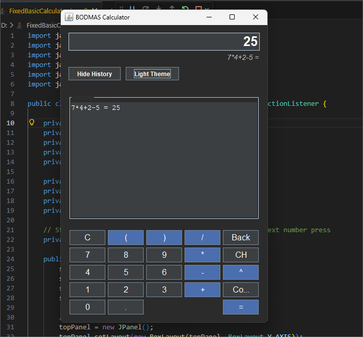
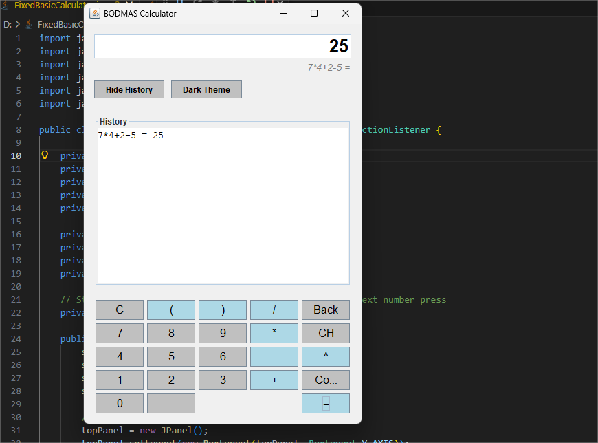
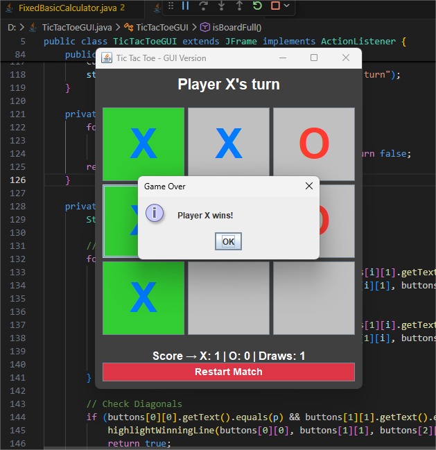

# calc-n-crosses-java 🧮❌⭕

My first repository on GitHub! This project contains two fully functional, beginner-friendly Java Graphical User Interface (GUI) applications: an advanced BODMAS Calculator and a classic Tic-Tac-Toe game. 

Both projects were built using **Java Swing** and demonstrate core object-oriented programming concepts, event handling, and custom algorithmic logic.

---

## Project 1: Advanced BODMAS Calculator (`FixedBasicCalculator.java`)
A robust graphical calculator that goes beyond standard step-by-step processing. It utilizes a custom **Recursive Descent Parser** to evaluate entire mathematical equations at once, strictly following the order of operations (BODMAS/PEMDAS).




### Features
**BODMAS Evaluation:** Accurately handles brackets `()`, exponents `^`, division, multiplication, addition, and subtraction in the correct mathematical sequence.
**Modern UI:** Built with Java Swing using responsive Layout Managers (`BorderLayout` & `GridLayout`).
**Dynamic Themes:** Built-in toggle to switch seamlessly between a sleek Dark Mode and a clean Light Mode.
**Session History:** Keeps a running log of your past calculations in a scrollable side panel.
**Robust Error Handling:** Safely catches syntax errors, handles division by zero ("Math Error"), and prevents crashes from invalid inputs.
**Clipboard Support:** Quickly copy your final results to your system clipboard.

---

## Project 2: Interactive Tic-Tac-Toe (`TicTacToeGUI.java`)
A sleek, two-player graphical version of the classic Tic-Tac-Toe game. It features dynamic visual feedback, real-time score tracking, and smooth reset mechanics.



### Features
**Interactive GUI:** A responsive 3x3 clickable grid built with custom fonts and padding.
**Color-Coded Players:** Player X (Blue) and Player O (Red) are visually distinct for a better user experience.
**Win Highlighting:** Automatically detects a win and highlights the winning row, column, or diagonal in green.
**Scoreboard:** Tracks continuous game sessions, recording X wins, O wins, and Draws.
**Restart Match Mechanics:** Includes a dedicated "Restart Match" button to clear the board mid-game or start a fresh round without losing the session score.
**Input Validation:** Prevents players from overwriting an already claimed square.

---

## How to Run Locally

### Prerequisites
**Java Development Kit (JDK) 8** or higher installed on your machine.

### Instructions
1. Clone this repository to your local machine:
   ```bash
   git clone [https://github.com/Nidhi-IT/calc-n-crosses-java.git](https://github.com/Nidhi-IT/calc-n-crosses-java.git)

### Navigate to the project directory:

Bash
cd calc-n-crosses-java

### To run the Calculator:

Bash
javac FixedBasicCalculator.java
java FixedBasicCalculator

### To run Tic-Tac-Toe:

Bash
javac TicTacToeGUI.java
java TicTacToeGUI

### Built With

Java - Core programming language.
Java Swing & AWT - Used for all graphical user interface components and event listeners.
